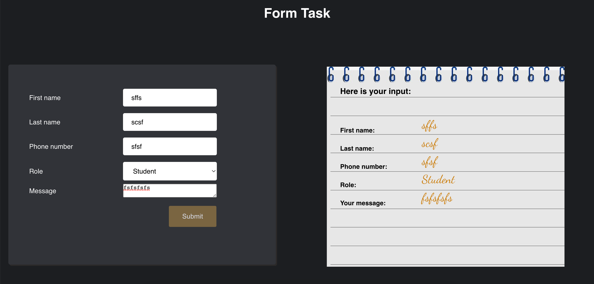
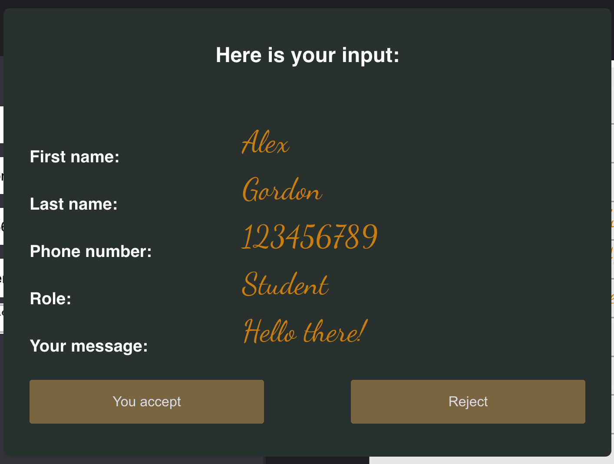

# About the App

The Form Task is a simple app where I practiced passing data from parent to child, onClick and onChange events, triggering modal popup component.

## Here are some screenshots from the app

## Note!

Please feel free to contact me if you have some sogessions how to improove it.

# TasteIT:

## Short description

Welcome to my FormTask application. This application is created as a task assigned to me as a part of my studies in REACT22S programme.

FormTask is a web application where users can input their notes and messages and send it to the database kept in .json format in local machine.

## Technologies used

### Built with:

- REACT
- CSS
- JS
- HTML
- JSON

## Setup and usage

Live page [here](https://codelamat.github.io/Animals-birds/). Note! You may face difficulties to see the database in livepage since the database is in local db file. It is recomended to clone the gitHub link and run the server locally.

## Screenshot

### Homepage

### Birds page

### Animals page

### Authors and acknowledgment

Eyvaz Alishov

- GitHub @CodeLaMat
- [LinkedIn](https://www.linkedin.com/in/eyvaz-alishov-54361054/)

## License

Copyright © 2022 [Eyvaz Alishov](https://github.com/CodeLaMat)

This project is [MIT](https://github.com/CodeLaMat/Animals-birds/blob/master/LICENSE) licensed

# Getting Started with Create React App

This project was bootstrapped with [Create React App](https://github.com/facebook/create-react-app).

## Available Scripts

In the project directory, you can run:

### `npm start`

Runs the app in the development mode.\
Open [http://localhost:3000](http://localhost:3000) to view it in your browser.

The page will reload when you make changes.\
You may also see any lint errors in the console.
